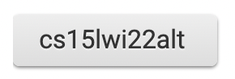
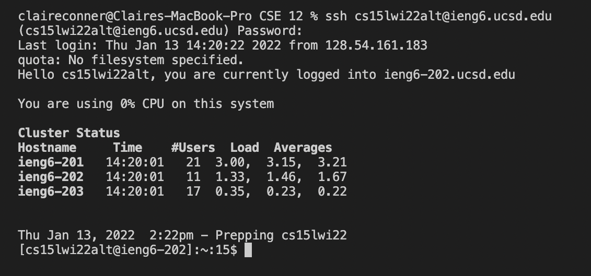
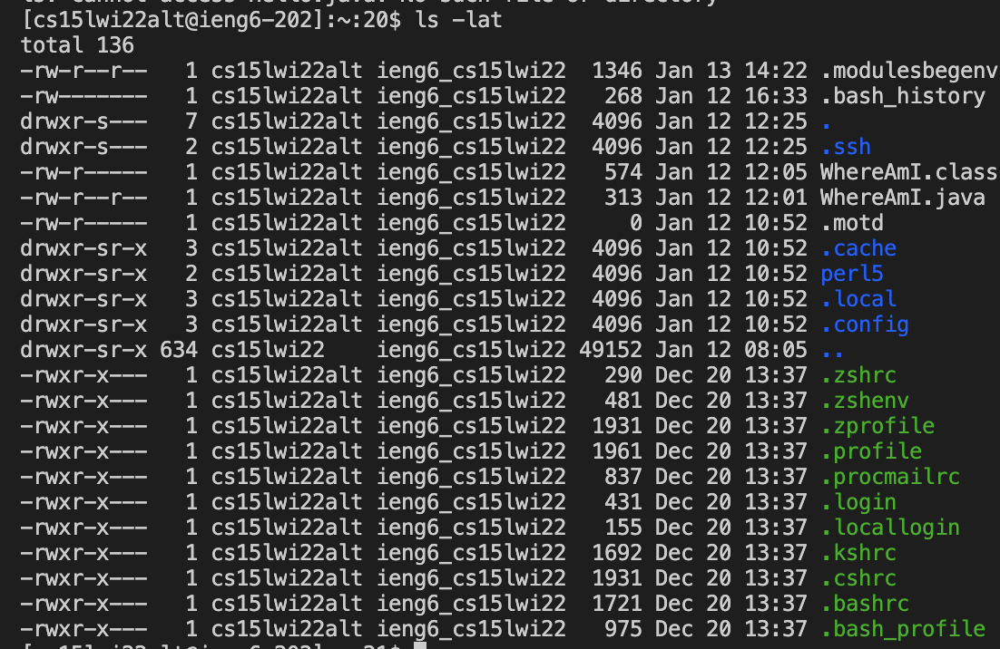
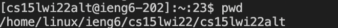
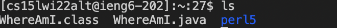
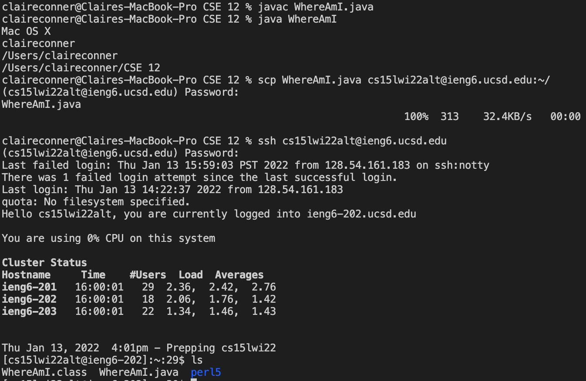
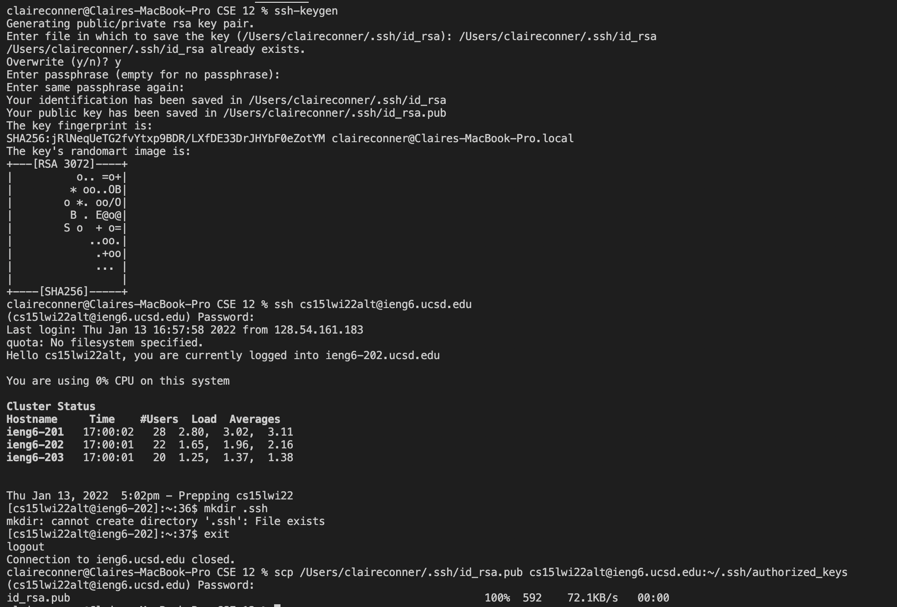
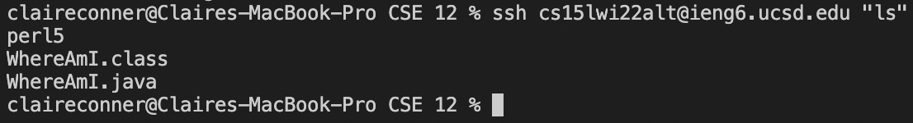
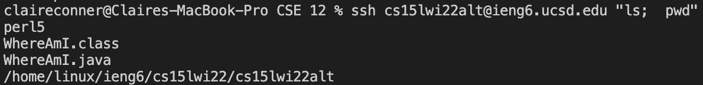

# How to log into a course-specific account on ieng6:

## 1. Installing VScode

## 2. Remotely Connecting
In order to remotely connect, you must first search up your course-specific account on this website: https://sdacs.ucsd.edu/~icc/index.php. 

*The username should look something like this*

After you have logged in using your username and your student ID, you can use the following command “ssh cs15lwi22zz@ieng6.ucsd.edu” to connect to the server– only you must replace “zz” with whatever your account says (mine says “alt”). Next, it prompts you to enter your password, though you won’t be able to see you’re typing it. You are then logged in, and it should look like this:

## 3. Trying Some Commands
The first command I have run on the server is the ls -lat command, which displays all of the files in the current directory.

The second command I have run on the server is pwd, which prints the path of the current directory.

Another command is ls, which lists the files in the current directory. 

**Note: in order to sign out of the server, you can use the command exit**

## 4. Moving Files with `scp`

If you run the following commands, it will allow you to copy a file onto the server and run it there-- in this case the file is called WhereAmI.java

Running the ls command allows you to see that th

## 5. Setting an SSH Key
Setting the ssh key (as shown below) allows you to skip the process of entering a password each time you login to ieng6. This saves a decent amount of time.

## 6. Optimizing Remote Running
To decrease the amount of time it takes to run even further, you can run commands at the same time as you log into the server:

You can even do this and run two commands at the same time: 

