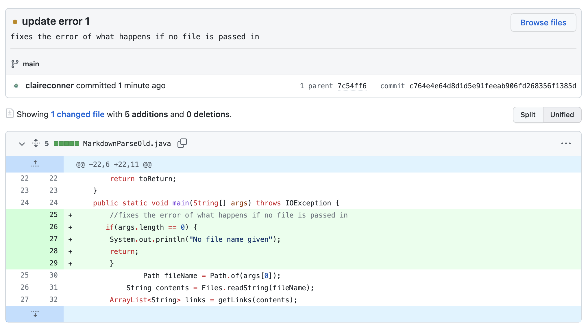
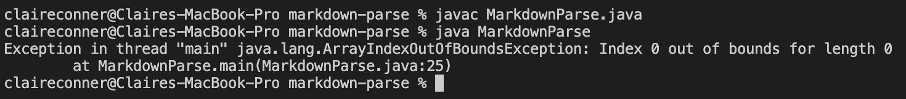
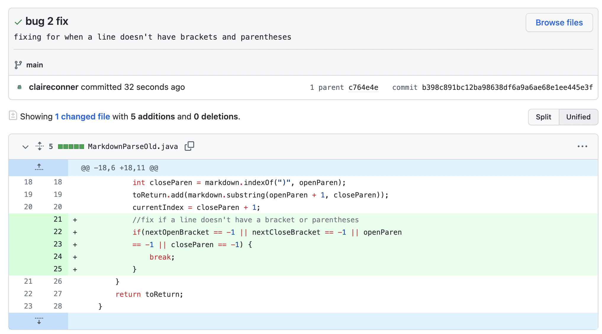
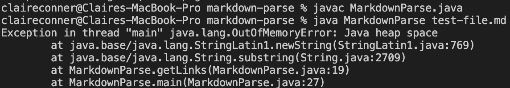
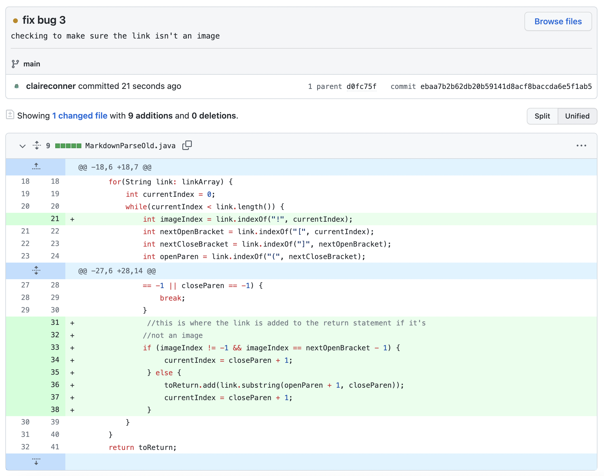
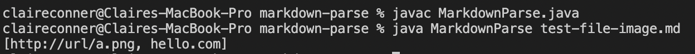

# Fixing Bugs from Labs 3 and 4

## First Fix

Code Change:
 

Link to Test File for Bad Input: 
There is NO TEST FILE because the problem with this bug is when no argument (or file) is passed in 

Symptom of Failure: 

Description: The symptom was that there is an index out of bounds error when no file is passed in. Therefore, the fix was to create an if statement in the main method so that if there is no file, markdown doesn't run. 

## Second Fix

Code Change:
 

Link to Test File for Bad Input: 
[test-file.md](lab-rep2-photo/test-file.md) 

Symptom of Failure: 

Description: The symptom was that there was a Java Heap error when the input of a link with only one parentheses was passed in. This causes an infinite loop because the index it was searching for (the parentheses) was never found.

## Third Fix

Code Change:
 

Link to Test File for Bad Input: 
[test-file.md](lab-rep2-photo/test-file-image.md) 

Symptom of Failure: 

Description: The symptom for this one is pretty interesting, since there is no error that is immediately visible. Rather, the input includes an image, which shouldn't be printed, but it is anyway. 

