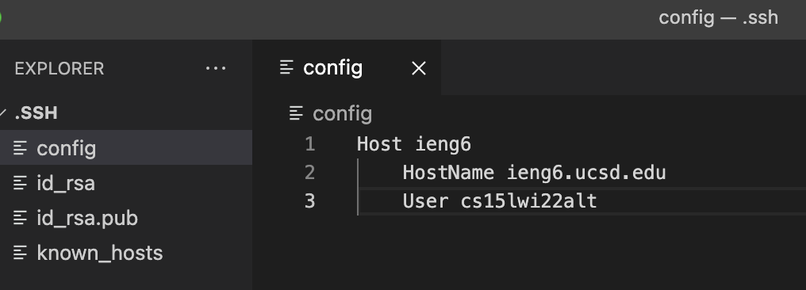
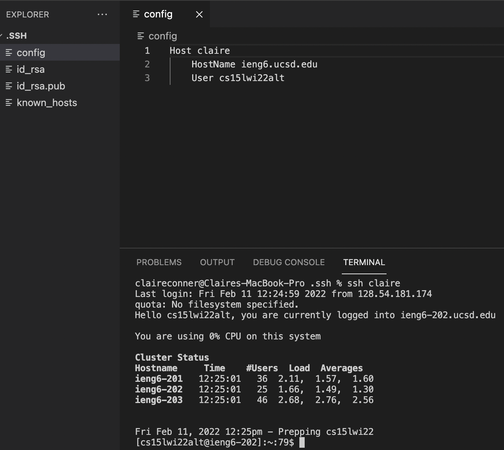
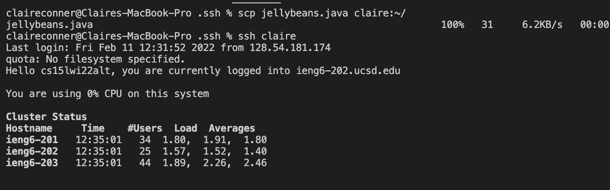

# Streamlining `ssh` Configuration

*click* [here](https://claireconner.github.io/cse15l-lab-reports/) *to go back to index page* 

## Edit `.ssh/config` file
 
To edit the `.ssh/config` file, I had to open the `ssh/` folder (which is a hidden folder). Then I opened the folder on VS code, added a new file named `config`, and put in the above code. 

## Use `ssh` command and alias to login
 
Before logging into the server, I changed my alias. To do this, I replaced the ieng6 after the word Host with whatever I wanted my alias to be. Then, to login, I ran the command `ssh claire`, where `claire` is the name of the alias I created. 

## Use `scp` command to copy file to account using alias

To copy a file, you first run the command `scp` (the name of the file) and then `claire:~/`, or the alias:~/
