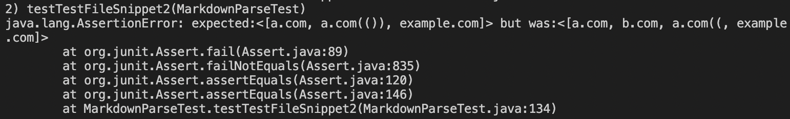

# MarkdownParse Snippets

*click* [here](https://claireconner.github.io/cse15l-lab-reports/) *to go back to index page* 

## Links to `markdownParse` Repositories
[My repository](https://github.com/claireconner/my-markdown-parse)

I had to delete the original repository for lab 5, so the repository would be slightly different (but have the same output)

[Other Repository](https://github.com/Stocktocon/markdown-parse)

## Code Snippet 1
**Expected Output:** 
using the CommonMark demo site
`["'google.com", "google.com", "ucsd.edu"]`

**Test** (the same for both repositories):

**Output for My Repository**

**Output for Other Repository**

## Code Snippet 2
**Expected Output:** 
using the CommonMark demo site
`["a.com", "a.com(())", "example.com"]`

**Test** (the same for both repositories):

**Output for My Repository**

**Output for Other Repository**

## Code Snippet 3
**Expected Output:** 
using the CommonMark demo site
`["https://ucsd-cse15l-w22.github.io/"]`

**Test** (the same for both repositories):

**Output for My Repository**

**Output for Other Repository**

## Questions

**Snippet 1**

I think there could be a small fix (less than 10 lines) to fix the inline backticks. This could be done by checking for a pair of backticks, and making any input between the backticks be code and not part of the link. 

**Snippet 2**

I think this code could be over ten lines, but what I would try would be making sure to have the innermost pair of brakets and parentheses. I think this would be a more involved change because there isn't one case you have to check for, there are several. We also tried to solve these cases in lab as a group, and we weren't able to cover all cases.

**Snippet 3**

I think there could be a small fix (less than 10 lines) to look for newlines in brackets and parentheses. It looks like it shouldn't work if there is a break/empty line, so I would just restart the search for the first bracket if there is an empty line. 

