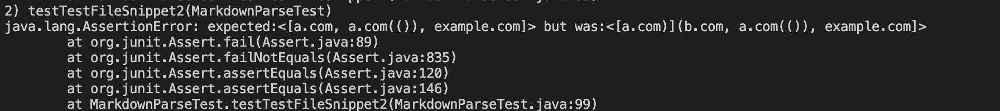

# MarkdownParse Snippets

*click* [here](https://claireconner.github.io/cse15l-lab-reports/) *to go back to index page* 

## Links to `markdownParse` Repositories
[My repository](https://github.com/claireconner/markdown-parse)

[Other Repository](https://github.com/Stocktocon/markdown-parse)

## Code Snippet 1
**Expected Output:** 
using the CommonMark demo site
`["'google.com", "google.com", "ucsd.edu"]`

**Test** (the same for both repositories):

**Output for My Repository**

**Output for Other Repository**

## Code Snippet 2
**Expected Output:** 
using the CommonMark demo site
`["a.com", "a.com(())", "example.com"]`

**Test** (the same for both repositories):

**Output for My Repository**

**Output for Other Repository**

## Code Snippet 3
**Expected Output:** 
using the CommonMark demo site
`["https://ucsd-cse15l-w22.github.io/"]`

**Test** (the same for both repositories):

**Output for My Repository**

**Output for Other Repository**

