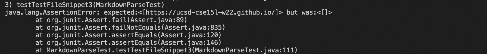
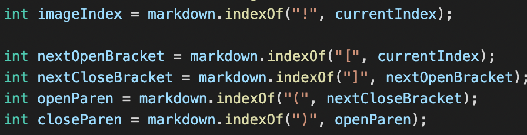
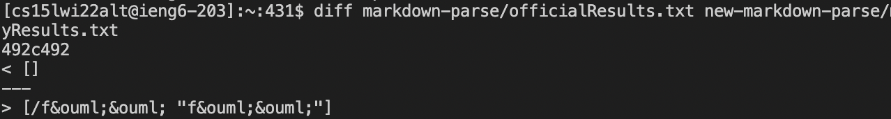
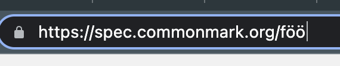
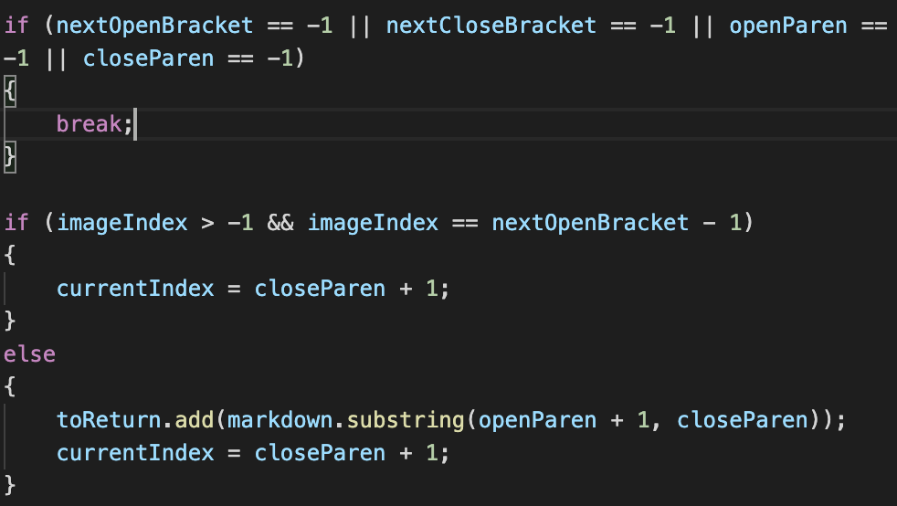

# commonmark-spec Test Debugging

*click* [here](https://claireconner.github.io/cse15l-lab-reports/) *to go back to index page* 

## How I found the tests
I found the tests by using `diff` on the results of running a bash for loop. To do this, I created a file of the results of running the test files in each version of markdownParse. Then, I used diff to compare these two files. 

## Test 22

**Actual Output**

From the provided markdown-parse repository, the output is `[]`. From my markdown-parse repository the output is `[/bar\\* "ti\\*tle"]`. 

**Expected output**

The expected output, according to commonMark, is `[bar\*]`, so they are both wrong. 

**How To Fix**

*This is my markdown-parse repository in which I will show a bug*

My implementation of markdownParse fails to account for the index of "\\" which is important because it negates whatever character comes after. 

It should add code that accounts for the backslash. 

## Test 32

**Actual Output**

From the provided markdown-parse repository, the output is `[]`. From my markdown-parse repository the output is `[/f&ouml;&ouml; "f&ouml;&ouml"]`. 

**Expected output**
The expected output, according to commonMark is: [foo](/f&ouml;&ouml; "f&ouml;&ouml;"), and when you click on the link it takes you to f&ouml;&ouml; :

Therefore both outputs are wrong. 

**How To Fix**

*This is the my markdown-parse repository in which I will show a bug*

My implementation of markdownParse fails to ignore the code within the quotation marks. This is because there is no code that checks for quotation marks. 

It should add code that accounts for quotation marks, and ignores the code inside (if it is part of a link).

